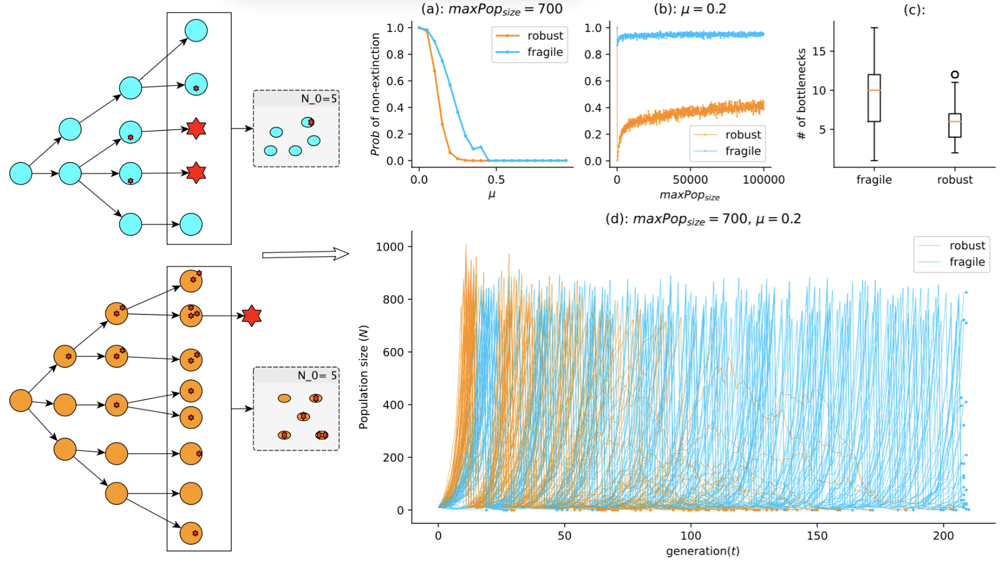

# EvoEpi
In this repository we provide the code and the minimum documentation that accompany our publication.
It provides an environment to simulate a simple branching process and SEIR epidemiological model including inhost branching process with bottleneck.

The repo is organised as follows: 
- `data/` which contains all the clean data used to produce the different plots presented in our paper.  the clean data are obtained by cleaning up the data generated from simulations. for more details please refer to the python notebook `data/clean_data.ipynb`
- `plots/` all the plot (in pdf) used in the paper and the Python notebook code is in `plots/bp_plot.ipynb` and `plots/seir_plot.ipynb`
- `src/`: it contains all the source codes  

# Installation and run

## Requirement
The following softwares are required:

- Python version 2.7 or higher
- Numpy
- Pandas
- Scipy
- Python-constraint
- multiprocess
- pp

To install all the requirements automatically via minicondo, simply type the following command:,

      pip -r requirement.txt
   
The installation was tested on the following operating systems: 

* MacOS Mojave 
* Debian Xfce 4.12 

## Run our code.

The code is organized in three main parts, all located in the folder `src/`
- The analytical results in `src/analytic`:
It contains two files:
    - `analytic.py`: set of python functions that implement all the analytical results in our paper. it is used in `analytical_seir.py`.
    - `main.py`: which shows a simple running example how to use the `analytic.py`

to run it, simply type in the director `src/analytic`:
      
      python main.py

- The branching process in `src/bp`:

- The epidemiological model in `src/seir`:
Here we have two alternatives of implementing the model we described in our paper: 
    - The first one is the explained in the paper see (`src/seir/basic_seir.py`) : 
    
   To run the basic SEIR simulation, please use the following command: 
   
      python `ppseir_basic.py` -Ir <infection rate> -Rr <recovey rate> -mu <mutation rate>
      
   - The second one is also explained in our paper : to run it please refer to the command used in the first case but on the file `src/ppseir_alternative.py` 
   
 For more details about the arguments needed to run each of those scrips, please use the command: 
 
      python <scrip-file-name> --help 
