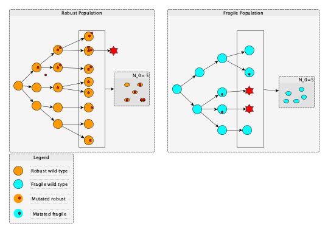

# Evo-Epi = Evolution and Epidemiology
<!--(@Author: [Nono Saha Cyrille Merleau](#) and [Matteo Smerlak](#) ) -->

In this repository, we provide the code and the minimum documentation that accompanies our publication [[1]](#).
It provides an environment to simulate a simple branching process and SEIR epidemiological model including inhost branching process with bottleneck.

**Figure 1:** Illustration of the branching process for a fragile and robust population. While the robust population loses its wild-type strains by cumulating deleterious mutations, the fragile one preserves them.  At each bottleneck, a new population is sampled from the last one, and it is used as the initial population for a new branching process*

The repo is organised as follows: 
- [data](data/): The clean data used to produce the different plots presented in our paper.  The cleaned data are obtained by cleaning up the data generated from simulations. For more details, please refer to the Python notebook [here](data/clean_data.ipynb)
- [docs] (docs): The files describing the algorithms and the dynamic of infection implemented.
- [images](images/): The plots (in pdf) used in the paper and the Python notebook code is in [src/notebooks/analytical.ipynb](src/notebooks/analytical.ipynb), [src/notebooks/bp.ipynb](src/notebooks/bp.ipynb) and [src/notebooks/seir.ipynb](src/notebooks/seir.ipynb)
- [src](src/): The source codes (including the ones used to produce the plots in the paper) and is organised in three main parts:
      
    - The analytical results in  [src/analytic](src/analytic):
    
      - [analytic.py](src/analytic.py): set of python functions that implement all the analytical results in our paper. it is used in `analytical_seir.py`.
      - [main.py](src/main.py): which shows a simple running example how to use the `analytic.py`
            
    - The branching process simulations in  [src/bp](src/bp):
      - [branching.py](src/bp/branching.py):
      - [survival_prob.py](src/bp/survival_prob.py):
      
    - The SEIR model in [src/seir](src/seir):
    
       - [ppseir_basic.py](src/seir/ppseir_basic.py): 
       - [ppseir_alternative.py](src/seir/ppseir_alternative.py): 
       - [ppseir_analytical.py](scr/seir/ppseir_analytical.py):

## Requirements
The following software is required:

- Python version 2.7 or higher
- Numpy
- Pandas
- Scipy
- Python-constraint
- multiprocess
- pp

To install all the requirements automatically via minicondo, type the following command:

      pip -r requirement.txt
   
The installation was tested on the following operating systems: 

* MacOS Mojave 
* Debian Xfce 4.12 

## How to run the simulation?
First, please clone the git repo using the command: 
      
      $ git clone [repo link](#)
      $ cd EviEpi

- Analytical result: For a simple example, refer to the main file in [src/analytic](src/analytic/main.py):
      
      	$ cd src/analytic 
      	$ python main.py

- The branching process: please use the python file [src/bp/branching.py](src/bp/branching.py) and a short example in [main.py](src/bp/main.py)
      
      	$ cd src/bp 
      	$ python main.py -T 100 -sd 0.9 -mBN 5 -u 0.1 --job 50 
      
  For more details about the parameters, please use the following: 
      
      	$ python main.py --help

- The epidemiological model:
Here, we have two alternatives for implementing the model we described in our paper: 
    - The first one is the basic one [src/seir/basic_seir.py](src/seir/basic_seir.py) : 
    
   To run the basic SEIR simulation, please use the following command in the directory [src/seir](src/seir/): 
   
      	python ppseir_basic.py -Ir <infection rate> -Rr <recovey rate> -mu <mutation rate>
      
   - The second one is also explained in our paper: to run it, please refer to the command used in the first case but on the file [src/ppseir_alternative.py.](src/ppseir_alternative.py.) 
   
 For more details about the arguments needed to run each of those scrips, please use the command: 
 
      	python <scrip-file-name> --help 

## Citations
If you use this code, please cite the following article

Merleau NSC, Pénisson S, Gerrish PJ, Elena SF, Smerlak M (2021) Why are viral genomes so fragile? The bottleneck hypothesis. PLOS Computational Biology 17(7): e1009128. [https://doi.org/10.1371/journal.pcbi.1009128](https://doi.org/10.1371/journal.pcbi.1009128)
