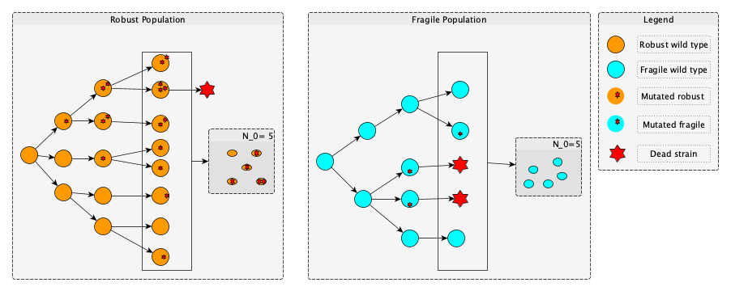

# Evo-Epi = Evolution and Epidemiology
(@Author: [Nono Saha Cyrille Merleau](#) and [Matteo Smerlak](#) )

In this repository we provide the code and the minimum documentation that accompany our publication.
It provides an environment to simulate a simple branching process and SEIR epidemiological model including inhost branching process with bottleneck.

***Figure 1:** Illustration of the branching proccess for a fragile and robust population. While the robust population looses its wild-type strains by cumulating deleterious mutations, the fragile one preserves them.  At each bottleneck, a new population is sampled from the last one and it uses as initial population for a new braching process*

The repo is organised as follows: 
- [data](data/) which contains all the clean data used to produce the different plots presented in our paper.  The cleaned data are obtained by cleaning up the data generated from simulations. for more details please refer to the python notebook [here](data/clean_data.ipynb)
- [images](images/) all the plots (in pdf) used in the paper and the Python notebook code is in: [src/notebooks/analytical.ipynb](src/notebooks/analytical.ipynb), [src/notebooks/bp.ipynb](src/notebooks/bp.ipynb) and [src/notebooks/seir.ipynb](src/notebooks/seir.ipynb)
- [src](src/): it contains all the source codes (including the ones used to procuce the plots) and is organized in three main parts:
      
    - The analytical results in  [src/analytic](src/analytic):
    
      - [analytic.py](src/analytic.py): set of python functions that implement all the analytical results in our paper. it is used in `analytical_seir.py`.
      - [main.py](src/main.py): which shows a simple running example how to use the `analytic.py`
            
    - The branching process simulations `src/bp`:
      - [branching.py](src/bp/branching.py)
      - [survival_prob.py](src/bp/survival_prob.py)
      
    - The SEIR model `src/seir`:
       - [ppseir_basic.py](src/seir/ppseir_basic.py) : 
       - [ppseir_alternative.py](src/seir/ppseir_alternative.py): 
       - [ppseir_analytical.py](scr/seir/ppseir_analytical.py)

# Requirements
The following softwares are required:

- Python version 2.7 or higher
- Numpy
- Pandas
- Scipy
- Python-constraint
- multiprocess
- pp

To install all the requirements automatically via minicondo, simply type the following command:,

      pip -r requirement.txt
   
The installation was tested on the following operating systems: 

* MacOS Mojave 
* Debian Xfce 4.12 

# How to run the simulation.

to run it, simply type in the director `src/analytic`:
      
      python main.py

- The branching process in `src/bp`:

- The epidemiological model in `src/seir`:
Here we have two alternatives of implementing the model we described in our paper: 
    - The first one is the explained in the paper see (`src/seir/basic_seir.py`) : 
    
   To run the basic SEIR simulation, please use the following command: 
   
      python `ppseir_basic.py` -Ir <infection rate> -Rr <recovey rate> -mu <mutation rate>
      
   - The second one is also explained in our paper : to run it please refer to the command used in the first case but on the file `src/ppseir_alternative.py` 
   
 For more details about the arguments needed to run each of those scrips, please use the command: 
 
      python <scrip-file-name> --help 
